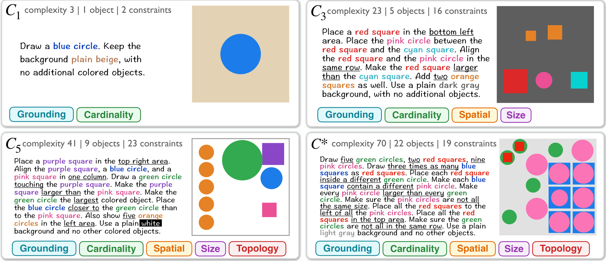

<div align="center">

# Verifiable Visual Rewards Transfer from Synthetic Scenes to Natural Prompts

[Shuyue Stella Li](https://stellalisy.com/), [Xiaochuang Han](https://xhan77.github.io/), [Yulia Tsvetkov](https://homes.cs.washington.edu/~yuliats/), [Luke Zettlemoyer](https://www.cs.washington.edu/people/faculty/luke-zettlemoyer/)

University of Washington

[](https://arxiv.org/abs/2609.35641)
[](https://x.com/StellaLisy/status/2104947596355846175)
[](https://huggingface.co/datasets/stellalisy/VVRBench)
[](LICENSE)



</div>

Precise instruction following in image generation, such as satisfying object counts and spatial relations, is usually trained with learned reward models such as object detectors and vision-language models. **Verifiable Visual Rewards (VVR)** replace them with deterministic program verifiers. Each VVR task is a scene of geometric objects and relations among them, from which we derive both the prompt and a verifier, so tasks can be generated in any number and at any chosen complexity.

- **VVRBench**: 10,000 tasks over 32 constraint types, plus VVRBench-Challenge with 720 more complex tasks. The strongest model we evaluate, GPT-Image-2.5, solves 21.4% of VVRBench-Challenge.
- **RLVVR**: using VVR scores as reinforcement learning rewards raises the accuracy of Stable Diffusion 3.5 Medium on VVRBench from 2.8% to 28.3%, and the gains extend to natural prompts outside VVR.

This repository contains the VVRBench evaluator and verifier (`vvr_bench/`) and the RLVVR training code (`rlvvr/`, `scripts/`, `configs/`).

## Data

All data is in [stellalisy/VVRBench](https://huggingface.co/datasets/stellalisy/VVRBench) on Hugging Face.

| Configuration | Split | Tasks | Use |
|---|---|---|---|
| `default` (VVRBench) | test | 10,000 | Main benchmark, complexity 3 to 48 |
| `fast` (VVRBench-Fast) | test | 820 | 20 tasks at each attainable integer complexity from 3 to 44 |
| `challenge` (VVRBench-Challenge) | test | 720 | 20 tasks at each integer complexity from 45 to 80 |
| `vvr_easy` | train | 100,000 | RLVVR training, complexity at most 20 |
| `vvr_matched` | train | 100,000 | RLVVR training, matched to the VVRBench distribution |

## Install

```bash
git clone https://github.com/stellalisy/VVRBench.git
cd VVRBench
pip install -e .
```

## Evaluate a model on VVRBench

1. Generate one image per task and save it as `{id}.png`, for example `vvr_bench_00000.png`. Alternatively, write a JSONL manifest with `id` and `image_path` fields.

   ```python
   from datasets import load_dataset

   tasks = load_dataset("stellalisy/VVRBench", split="test")  # or "fast", "challenge" as the config name
   for task in tasks:
       image = generate(task["prompt"])  # your model
       image.save(f"images/{task['id']}.png")
   ```

2. Score the images. The evaluator downloads the pinned benchmark data and checks its hash and the verifier's hash.

   ```bash
   vvr-bench-evaluate --predictions-dir images --output-dir results --require-complete
   vvr-bench-evaluate --config fast --predictions-dir images_fast --output-dir results_fast --require-complete
   vvr-bench-evaluate --config challenge --predictions-dir images_challenge --output-dir results_challenge --require-complete
   ```

The evaluator writes `summary.json` and `per_example.jsonl`. The main metric is accuracy: the fraction of tasks whose image satisfies every constraint.

| Field | Meaning |
|---|---|
| `strict_accuracy` | Accuracy over the tasks that have an image |
| `strict_accuracy_missing_as_failure` | Accuracy with missing images counted as failures, as in the paper |
| `strict_by_difficulty` | Accuracy by complexity range: `1` to `5` are the VVRBench ranges C1 to C5 on VVRBench and VVRBench-Fast, and five equal-width ranges from 45 to 80 on VVRBench-Challenge (the paper's VVRBench-Fast and Challenge tables use their own integer ranges) |
| `strict_by_criterion` | Pass rate of each constraint type |
| `dense_vvr`, `by_difficulty`, `by_family`, `by_criterion` | Partial-credit scores; do not report these as accuracy |

Pass `--require-complete` to stop when an image is missing.

The evaluator scores each image at the resolution you save it. In the paper, open-weight and post-trained models were scored on VVRBench after resizing to 512×512; API models on VVRBench-Fast and all models on VVRBench-Challenge were scored at 1024×1024.

## The verifier

`vvr_bench/verifier.py` extracts objects from the image with fixed pixel operations and checks each constraint with a program verifier. `score_image_spec(image, spec)` returns a score and a dictionary of per-constraint results; `strict` in that dictionary is the pass-or-fail decision used for accuracy. [`VERIFIER.md`](VERIFIER.md) lists the 46 constraint types and the validation record.

## Train with RLVVR

RLVVR trains Stable Diffusion 3.5 Medium with [Flow-GRPO](https://github.com/yifan123/flow_grpo) and a LoRA adapter (rank 32). The VVR reward is the verifier's partial-credit score multiplied by soft gates for object count, shape, relations, extra objects, and forbidden content (`rlvvr/rewards.py`). It is computed with the released verifier, `vvr_bench/verifier.py`.

1. Install the training dependencies (add `,ocr` for the OCR runs):

   ```bash
   pip install -e ".[train]"
   ```

2. Build the training sets. The script downloads the VVR tasks from Hugging Face and the GenEval, GenEval2, OCR, and PickScore prompts from their public repositories. It then rebuilds each paper mixture row by row, in the paper's order, from the lists in `data/idlists/`.

   ```bash
   python scripts/prepare_data.py --out data
   ```

3. Start the reward servers if the run uses GenEval, GenEval2, or UnifiedReward (see [`reward_servers/README.md`](reward_servers/README.md)).

4. Train. Pick one of the nine paper runs:

   ```bash
   accelerate launch --num_machines 32 --num_processes 256 ... \
     scripts/train_rlvvr.py --config configs/rlvvr.py:vvr_easy
   ```

| Config | Paper run | Training data | Reward |
|---|---|---|---|
| `vvr_easy` | VVR-Easy | 100,000 VVR-Easy tasks | VVR |
| `vvr_matched` | VVR-Matched | 100,000 VVR-Matched tasks | VVR |
| `geneval2_vvr_easy` | GenEval2 + VVR-Easy | 720 GenEval2 prompts + VVR-Easy | per-prompt source |
| `geneval2_vvr_matched` | GenEval2 + VVR-Matched | 720 GenEval2 prompts + VVR-Matched | per-prompt source |
| `ocr_vvr_easy` | OCR + VVR-Easy | 19,649 OCR prompts + VVR-Easy | per-prompt source |
| `five_reward_vvr_easy` | Five-reward + VVR-Easy | 720 prompts per reward + VVR-Easy | per-prompt source |
| `geneval2` | GenEval2 | 720 GenEval2 prompts | GenEval2 |
| `ocr` | OCR | 19,653 OCR prompts | OCR |
| `five_reward` | Five-reward | 720 prompts each for GenEval, GenEval2, OCR, PickScore, UnifiedReward | per-prompt source |

In the mixtures, every batch draws the same number of unique prompts from each source, and each image is scored by its prompt's reward.

All runs sample 24 images per prompt with 25 denoising steps at 512×512 and stop after 3,000 optimizer steps. The VVR runs used 256 GPUs with gradient accumulation 1. The three baselines used 64 GPUs with gradient accumulation 4. The number of GPUs times `sample.train_batch_size` (3) must be divisible by `sample.num_image_per_prompt` (24). Checkpoints in `logs/<run>/checkpoints/checkpoint-<step>/lora` hold the EMA LoRA weights. Pass `--config.train.lora_path=<that path>` to resume from one.

## Citation

```bibtex
@misc{li2026verifiablevisualrewardstransfer,
      title={Verifiable Visual Rewards Transfer from Synthetic Scenes to Natural Prompts},
      author={Shuyue Stella Li and Xiaochuang Han and Yulia Tsvetkov and Luke Zettlemoyer},
      year={2026},
      eprint={2609.35641},
      archivePrefix={arXiv},
      primaryClass={cs.AI},
      url={https://arxiv.org/abs/2609.35641},
}
```

## License

MIT; see [`LICENSE`](LICENSE). The training code is adapted from [Flow-GRPO](https://github.com/yifan123/flow_grpo) (MIT, Copyright (c) 2025 Jie Liu; see [`licenses/FLOW_GRPO_LICENSE`](licenses/FLOW_GRPO_LICENSE)).
